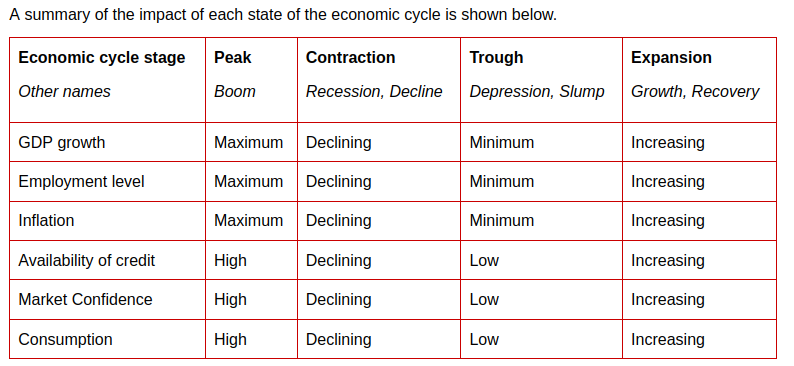

# 1) A The business organisation and its external environment
### What is an organisation 
Defining an organisation is difficult as there are many types of organisations
which are set up to meet a variety of needs, such as clubs, schools companies,
charities and hospitals.

What they all have in common is summarised in the definition produced by
_Buchanan and Huczynski._

Note the three key aspects of this definition:
- collective goals
- social arrangements
- controlled performance

Organisations enable people to:
- Share skills and knowledge – this can enable people to perform tasks
that they would be unable to achieve on their own. Knowledge can also be
shared between all the people within the organisation.
- Specialise – individual workers can concentrate on a limited type of
activity. This allows them to build up a greater level of skill and knowledge
than they would have if they attempted to be good at everything.
- Pool resources – whether money or time.

This results in synergy where organisations can achieve more than the
individuals could on their own

## Different types of business 

### Category one - Commercial versus not-for-profit 

Commercial (or profit-seeking) organisations see their main objective as
maximising the wealth of their owners.

- sole trader
- partnership 
- limited liability 
  - priavte limited
  - public limited 

Not-for-profit organisations (NFPs or NPOs) do not see profitability as
their main objective. Instead, they seek to satisfy the particular needs of
their members or the sectors of society that they have been set up to
benefit.

- government departments and agencies (such as HM Revenue
and Customs)
- schools
- hospitals
- charities (such as the Red Cross, Oxfam and Doctors Without
Borders)
- clubs.

### Category Two - Public vs private sector organisations
#### Public Sector Organisations
The public sector is the part of the economy that is concerned with
providing basic government services and is controlled by government
organisations.

private sector oragnisations that are run by private individuals and groupd rather than the government.

### Non-Governmental organisations (NGOS)
A non-governmental organisation is one which does not have profit as its
primary goal and is not directly linked to the national government.
NGOs often promote political, social or environmental change within the
countries they operate.

### Co-operatives 
Co-operatives are organisations that are owned and democratically
controlled by their members – the people who buy their goods or
services. Each member usually gets a single vote on key decisions –
unlike companies where shareholders get one vote for each share that
they own.

4 - A
5 - C
6 - D
7 - C
8 - C
9 - C

## Sectors in which organnisations operate 
Agriculture – production, processing and packaging of foodstuffs.
- Mining – extraction and processing of minerals.
- Finance – this includes banks and other companies that profit through
investments and the lending of money to others.
- Retailers – sale of goods produced by manufacturers to consumers.
- Service – production of intangible goods and services.
- Transportation – movement of goods between locations.

### Summary categorisation 
Ownership - private or state owned 
Objectives - Profit or social service
Activities - 
Source of fundind - rasie money from government or individuals
Size - multination or sole trader
liability - limited or non-limited liability

# 2) Business organisationand structure

Organisation structure -  the work work is divided up and allocated.
- roles
- ressponsibilities

# 2. Stake holders

The Mendelow (Power-Interest) Matrix - 
The amount of effort management takes to satisfy the needs of a stakeholder depends on the stakeholder’s power and interest relative to other stakeholders.

| power | | low |  High
|-------|----|-------|-------
|       | Low | minimal effort | keep informed 
|       | High| keep satisfied | Key Players

# 3. Business and it's environment 

###  2.1. Sources of legal authority
- statute
- case law 
- delegation 
- supra-national bodies
- local governments

## 2.2 Political Systems 
- Supra-national ( United nation, European unions and others)
impacts ( import/ export, transfer pricing)
- nationation impacts ( taxes, audit requirements, employment, data security, environment, annual return filing )
- regional / local impacts  ( local taxes, operating and ads licenses and building permissions)

*Data Subject - Individuals whose data is processed.*

*Data User - Entities that collect, store and process personal data*

*Data processing - any action performed on data*

*Personal data - Any information relating to an individual that can be directly or indirectly indentified*

### 4.1.1 Microeconomic environment
__Microeconomic policies are aimed at:__
- Real Gdp growth - total expenditutre 
- Full employment - unemploment rate %
- controlled inflation - inflation rate %

__Other Aims__

- Control prices of essential goods and services
- Attracting foreign investment
- Maintain a favourable balance of payments (imports vs exports)
- Encouraging producers to move up the value chain
- Improving economic capacity and infrastructure (supply-side)
- Manage local currency’s foreign exchange rate.

### GDP - Gross Domestic Product
The value of the economy’s total output at a given price level for a period.

The total expenditure in the economy for a period. It is essentially the total demand in the economy.
 
 ### Real GDP 
 Real GDP” used in the graph means the total output (produced goods and services) of the economy valued at a fixed currency base (i.e. US$ in March 20X2).

 

 __GDP calculation__
 
 C = consumption, localpopulation's consumption
 I = Investment, commercial Expenditure on assets
 G = Government spending , 
 X = Export and M = Imports, the net impact of exports and imports.

 GNP - gross national product is similar to GDP with the addition of international cash flows. it measures the total economic output of a country's residents.
 

 Income remitted from other countries 

 income remitted to other countries

 Factors affecting Determinants of GDP 

 ## Consumption
 - Consumer wealth - More income and access to borrowing
 - consumer expectation - confidence in future economy
 - personal taxes - taxation level 
 - savings rate - High savings reduce consumption 
 ## Investment
 - Interest rates - high interest rate reduces desire to borrow and invest.
 - Profit expections - expectred returns
 - Availability of finances.
 ## Government Spending
 - Availability of Funds - taxes, borrowings, and foreign aid
 - political tends - political agendas
 ## Net of exports and imports
 - Foreign Incomes - Increase in income will increase desire to import
- Exchange rates - Favourable exchange rates may affect imports and exports

## Aggregate Supply
The real value of the total output an economy can produce in a period.

## DETERMINANTS OF AGGREGATE SUPPLY
- Input prices - prices of input to produce
- Productivity - the possible level of production
- Legal institutional environment - state of legal and regulatory factors ( government grants, subsidies, regulations)

AD AND AS affect the state of the economy,
a shift of AD to the right (increase in AD) without a corresponding increase in AS will lead to demand pull inflation.

__Equilibrium GDP__ is the intersection between AD and AS.

### 2.3 Economic Cycles
The fluctuations in economic activity over time, characterised by states of expansion and contraction.

- Expansion - Economic activities in year 2 is greater than activities in year 1.
- peak economic activities is at it's maximum
- contaction economic activities in a period is lower than the level in a corresponding previous period.
- trough -  the level of economic activities is at a minimum 

